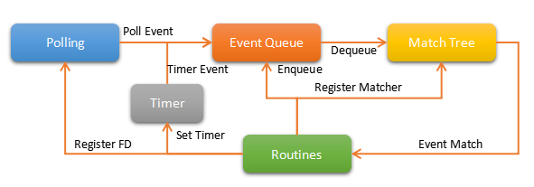

.. _asynccore:

Asynchronous Core Design
=========================

This is the design of VLCP asynchronous core.

.. _vlcpevents:

==============
Event Objects
==============

The most principal synchronizing method in VLCP is **Event Object**/**Event Matcher**.

**Event Objects** are instances of event classes. An event class is a subclass of :py:class:`vlcp.event.event.Event`.
When defining an event class, the decorator :py:func:`withIndices` is used to create 0, 1 or more indices for
this event class. When an event object is created, one value for each index must be assigned from the arguments.
For example::

   @withIndices('id', 'network')
   class PortCreatedEvent(Event):
       pass

defines an event class `PortCreatedEvent`, with two indices: the port id `id` and the network id `network`. And::

   new_event = PortCreatedEvent('new_port', 'my_network')
   id = new_event.id
   network = new_event.network

Creates a new event whose port id is `'new_port'` and network id is `'my_network'`. Notice that value for each
index does not have to be strings, but must be hashable values like integers, objects or tuples, and cannot be `None`.
The values for the indices are automatically set to corresponding attributes of the event object. Other attributes
can be set with extra keyword arguments.

An **Event Matcher** matches some types of event objects. It can be created from `createMatcher` method of an event
class::

   # Matches PortCreatedEvent with id = 'new_port' and network = 'my_network'
   my_matcher1 = PortCreatedEvent.createMatcher('new_port', 'my_network')
   # Matches PortCreatedEvent with id = 'new_port'
   my_matcher2 = PortCreatedEvent.createMatcher('new_port')
   # Matches PortCreatedEvent with network = 'my_network'
   my_matcher3 = PortCreatedEvent.createMatcher(None, 'my_network')
   # Matches any PortCreatedEvent
   my_matcher4 = PortCreatedEvent.createMatcher()
   # Use a customized function to test events
   my_matcher5 = PortCreatedEvent.createMatcher('new_port',
                     _ismatch = lambda x: x.network.startswith('my_'))

An event matcher matches an event object when:

   1. The event object is an instance of the corresponding event class (or one of its sub class)
   
   2. All the specified index values match the values of the event object
   
   3. If `_ismatch` is specified, the customized function must return True for this event object.

.. note:: Whenever possible, event matchers should use indices to match the events. Matching an event object
          with event matchers having different index values is O(1), while matching an event object with
          event matchers having different `_ismatch` is O(N) - every event matcher is tested once.
          
An event class can be subclassed. The subclassed event class inherits all the indices from the parent class,
and can have its own indices. Rules for matches for subclassed event classes are:

   1. An event matcher of the parent class can match a subclassed event object
   
   2. An event matcher of a subclassed event class CANNOT match an event object of the parent class or other subclasses
   
When an event matcher or an event object of a subclassed event is created, the arguments should consist of all indices
from the ancestors to the descendants.

.. note:: event objects and event matchers also accept keyword-arguments on initializing, but mixing placement
          arguments and keyword arguments is NOT supported.

.. _vlcproutines:

====================================
VLCP Routines and Routine Containers
====================================

VLCP is a coroutine-based framework. Each coroutine is a Python generator which yields tuples of event matchers::

   def new_routine():
       # Wait for event1
       yield (event_matcher1,)
       # Some work...
       # Wait for event2
       yield (event_matcher2,)

On each yield, the routine is suspended by scheduler to wait for an event object which matches one of the
yielded event matchers. When this event object appears, scheduler wake up the routine to let it continue.
An event object can wake up multiple routines, and the routines will be executed in order.

Each routine is associated with a **Routine Container**. The routine container is an object of type
:py:class:`vlcp.event.runnable.RoutineContainer`. It is used as the executing context of the routine.
When the routine awakes, the matched event object is saved to `container.event` and the matcher which
matches this event is saved to `container.matcher`. Routines use these variables to determine what to do next.

A coroutine method (generator) can be called with a for-loop (or `yield from` in Python 3.4+) as long as they
are associated with the same **Routine Container** (or the method accepts the routine container as a parameter)::

   for m in my_method(container):
       yield m

.. note:: You must use the for-loop (or `yield from`) to call a coroutine method. Use only `my_method(container)`
          does not have any effect. Beginners are easy to make this mistake.

Coroutine methods can return value through the routine container. Usually it uses `container.retvalue`, but some
methods use different names, please read documents of those methods.

Routine containers have some helpful methods to construct common work flows. One of the most important methods is
`waitForSend`, which sends an event object to wake up other routines::

   for m in container.waitForSend(my_event):
       yield m
       
The sending process is asynchronous, which means the method returns before other routines receive this event object.

Another method `subroutine` creates a new routine and let it executes independently::

   def new_routine():
       ...
       
   container.subroutine(new_routine())

It is quite similar to the `go` statement in Golang.   

If a coroutine method must be executed in a specified container, you can call it from another container with
`delegateOther` method::
   
   for m in container.delegateOther(remote_routine(), remote_container):
       yield m
       
   retvalue = container.retvalue[0]

See :py:class:`vlcp.event.runnable.RoutineContainer` for all the useful methods.

.. _vlcpscheduler:

=========
Scheduler
=========

A VLCP scheduler consists of an event queue, a match tree and a polling provider, like in figure :ref:`figure_scheduler`.

.. _figure_scheduler:

   
   Scheduler Work Flow

**Match Tree** is a *trie* (or *prefix tree*) which matches event objects with event matchers. It returns event
matchers which matches an event object in O(1) time. Routines register the event matchers they are waiting for
into the match tree with `yield` expression, and wait for a matching event.

In the main loop, scheduler takes event objects out of the **Event Queue**. Then scheduler uses the event object to find
matched event matchers and their corresponding routines. Scheduler executes the routines until they reach the next `yield`
expression. In the while, the routines may send new event objects into the event queue, register file descriptors
to the polling provider, or set timers.

When there is no event objects in the event queue, or the event processing limit is reached, scheduler uses the
polling provider to wait for socket activities until next timer is triggered. The generated polling events and
timer events are sent to the event queue.

.. _vlcpqueue:

===========
Event Queue
===========

Event queue in VLCP stores and reorders event objects. The main queue consists of multiple subqueues, each has
an event matcher. Event objects are classified by these event matchers into subqueues. Each subqueue has a different
priority, so that events in higher priority subqueues are retrieved first. Events in different subqueues with a same
priority are retrieved in round-robin order. This helps on reducing latency for critical messages or balancing CPU
usage to different connections on high load. A subqueue can also have subqueues to provide more control on event
priorities.

A subqueue can have size limit, so that when the subqueue is full, the routine which tries to send an event with
`waitForSend()` stops and wait for the queue to have space for more events. This provides an easy way to create
a robust consumer-producer system.

Subqueues can be created or removed by routines when the scheduler is running. Event senders and receivers do not
have to care about subqueues, they always send to / receive from the main event queue, thus are not affected by
subqueue changes. Events stored in a subqueue can be cleared if necessary.

Routines can also wait for a subqueue to be empty. 

.. _blockingevents:

===============
Blocking Events
===============

Usually when an event object is taken from the event queue, it will be ignored if there are no event matchers matching
this event. Some important events cannot be ignored and must be processed correctly. If there are no matching
event matchers currently, the event is delayed until a matching event matcher is registered. This kind of events
is called blocking events.

A blocking event is simply an event object with `canignore = False`. Usually it is set on the event class to make
the event object blocking by default, like::

    @withIndices('id')
    class MyBlockingEvent(Event):
        canignore = False
    
When an event object is processed, the routine should set `canignore = True` on the event object immediately::

   def my_routine(container):
       matcher = MyBlockingEvent.createMatcher(12)
       yield (matcher,)
       event = container.event
       event.canignore = True
       
When a blocking event is not processed correctly, it goes back to the subqueue from the front end, and blocks
the subqueue until it is matched by a newly registered event matcher. The processing order of the events are not
changed. If the subqueue contains this event has a size limit, producers of these events are blocked until consumers
begin to process these events.

Sometimes we need to discard blocking events that are no longer needed. Besides clearing the subqueue which contains
these events, the event class can provide an `canignorenow()` function to make the blocking conditional. When scheduler
processes an event object with `canignore=False` and also `canignorenow()`, it executes `canignorenow()` which returns
a boolean value. If `canignorenow()` returns True, scheduler set `canignore=True` on the event object and ignore it.
This only happens when an event object is take out from the event queue, so events which are already blocking the
subqueues cannot be ignored. A routine should use scheduler method :py:meth:`vlcp.event.core.Scheduler.ignore`
together with `canignorenow()` to correctly ignore these events.

.. _connectionprocessing:

=====================
Connection Processing
=====================

VLCP processes all sockets (including TCP connections and UNIX connections) with routines.

The :py:class:`vlcp.event.connection.Connection` class is responsible for all the lower-level socket operations.
It creates a reading routine, a writing routine and a controlling routine for each connection.

Reading routine uses a protocol class (subclass of :py:class:`vlcp.protocol.protocol.Protocol`) to parse the
byte stream into event objects. When sending the event objects, queue size limit may cause the routine to stop
to wait for event processing, thus stop receiving on the socket. For streaming sockets (TCP, UNIX), traffic control
on this connection makes the remote side stop sending more data.

Writing routine waits for :py:class:`vlcp.event.connection.ConnectionWriteEvent` event objects for this connection.
Data retrieved from the event objects are sent to the socket. `ConnectionWriteEvent` objects are blocking events,
so when the writing routine cannot write more data to the socket, it will start to wait for the polling event for
socket write, so routines generating the `ConnectionWriteEvent` are blocked until more data can be written to the
socket. Producers do not need to worry about generating too many data to send.

Controlling routine waits for connection control events which shutdown or restart the connection.

.. _connector:

=========
Connector
=========

A connector is a bridge between VLCP schedulers and other threads or processes. It sends events to other threads
from a thread-safe queue, and receives events from a pipe. With connectors it is quite easy to create a thread pool
to execute methods in a multi-threaded way.

A specialized connector *TaskPool* (:py:class:`vlcp.utils.connector.TaskPool`) is a simple thread pool implementation
for executing tasks in other threads.

