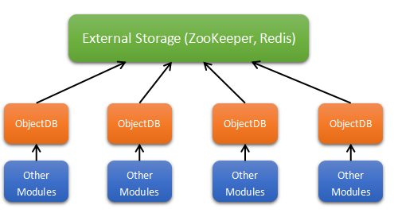
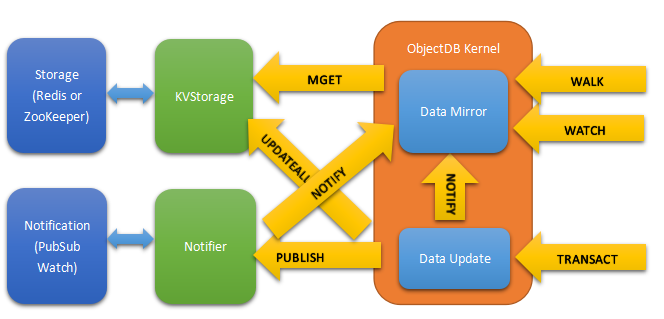
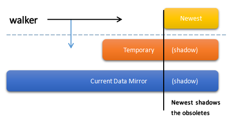
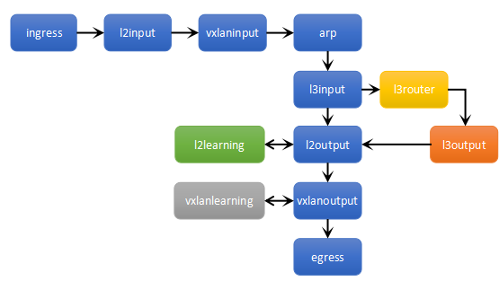

.. _figures:

More Figures, Less Text
========================

These are figures used in other parts of this document. Is there any interesting topic for you?

.. figure:: _static/images/physicalnetwork.png
   :alt: Physical View of the Network
   
   Physical View of the Network

This is the physical view of the SDN network. VMs or containers are in different servers, but we want to
organize them in a logical way. See :ref:`figure_physicalnetwork`.

.. figure:: _static/images/logicalnetwork.png
   :alt: Logical View of the Network
   
   Logical View of the Network

This is the logical view of the same network. VMs or containers are organized by their logical positions;
their physical positions do not matter. See :ref:`figure_logicalnetwork`.

.. figure:: _static/images/forwarding.png
   :alt: L3 Network with Forwarding Nodes
   
   L3 Network with Forwarding Nodes

This is a network with forwarding nodes. A forwarding node forwards traffic between SDN networks and traditional
networks. In VLCP, the forwarding nodes are just normal SDN controllers with a few configurations turned on.
See :ref:`figure_forwarding`.

.. figure:: _static/images/settings.png
   :alt: Network Settings Structure
   
   Network Settings Structure

This is how we configure our SDN network. See :ref:`figure_settings`.

.. figure:: _static/images/techstack.png
   :alt: Technology Stack of VLCP
   
   Technology Stack of VLCP

This is the technology stack of VLCP - how this software is built. See :ref:`figure_techstack`.

.. figure:: _static/images/modules.png
   :alt: Modules of VLCP
   
   Modules of VLCP

This is the current modules and relationships between them. See :ref:`figure_modules`.

.. figure:: _static/images/scheduler.png
   :alt: Scheduler Work Flow
   
   Scheduler Work Flow

This is the design of the core scheduler of VLCP, it provides asynchronous programming interfaces for this software.
See :ref:`figure_scheduler`.

   
   Central Storage

This is the architecture of the central storage system. VLCP uses an external KV-database for data storage, any nodes
can read from or write to the central database independently. A transaction layer - ObjectDB is used to synchronize
these operations. See :ref:`figure_centralstorage`.

   
   ObjectDB Basic Design

This is the design of ObjectDB. See :ref:`figure_objectdb`.

   
   Isolation of Data Space for walkers

This is the description of isolations for walkers. ObjectDB uses a special way - `walker` function to describe a
reading transaction, and uses `updater` function to describe a writing transaction. This provides a very flexable
and easy way to use the transaction. When executing a walker, VLCP uses this technique to provide consistent data
for the walkers. See :ref:`figure_walkers`.

   
   OpenFlow Tables

This is the currently used OpenFlow tables in VLCP. See :ref:`figure_sdntables`.

