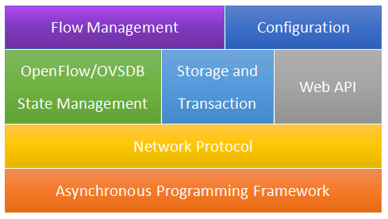
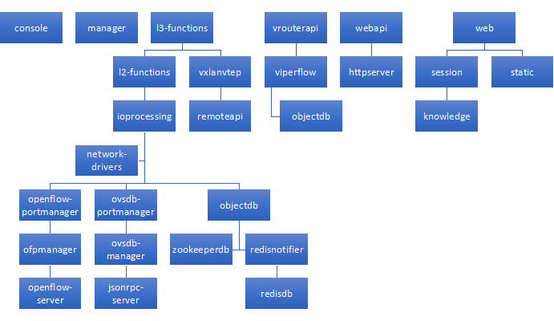

.. _overalldesign:

Architecture Overview
======================

This is the overall design of VLCP

.. _techstack:

----------------
Technology Stack
----------------

VLCP consists of multiple layers, each solves different problems and use different techniques.
Following figure :ref:`figure_techstack` shows the technology stack of VLCP:

.. _figure_techstack:

   
   Technology Stack of VLCP

.. _asyncframework:

----------------------------------
Asynchronous Programming Framework
----------------------------------

VLCP uses a special designed asynchronous programming framework to deal with network I/O and other
problems. Similar to *asyncio* in Python 3.4+, This framework uses Python generators as coroutines,
but there are some differents between *asyncio* and VLCP.

For further reading: :ref:`asynccore`.

.. _networkprotocol:

------------------------
Network Protocol Parsing
------------------------

VLCP framework uses an extensible way to deal with network protocols, which separates lower-level
socket processing with specified protocol processing. For each network protocol, a protocol class
derived from :py:class:`vlcp.protocol.protocol.Protocol` is created to parse the byte stream to
messages.

VLCP currently implements: OpenFlow, JSON-RPC(OVSDB), HTTP, RESP(Redis) and ZooKeeper protocols.
OpenFlow (1.0 and 1.3) and ZooKeeper protocols are processed with
`namedstruct <https://namedstruct.readthedocs.io/en/latest/>`_, which is a flexible library
for parsing and constructing binary structures. Structs are defined like::

   ofp_flow_mod = nstruct(
     (uint64, 'cookie'),            #  /* Opaque controller-issued identifier. */
   # /* Mask used to restrict the cookie bits
   # that must match when the command is
   # OFPFC_MODIFY* or OFPFC_DELETE*. A value
   # of 0 indicates no restriction. */
     (uint64, 'cookie_mask'),
   # /* ID of the table to put the flow in.
   # For OFPFC_DELETE_* commands, OFPTT_ALL
   # can also be used to delete matching
   # flows from all tables. */
     (ofp_table, 'table_id'),
     (ofp_flow_mod_command.astype(uint8), 'command'),           #  /* One of OFPFC_*. */
     (uint16, 'idle_timeout'),     #  /* Idle time before discarding (seconds). */
     (uint16, 'hard_timeout'),     #  /* Max time before discarding (seconds). */
     (uint16, 'priority'),         #  /* Priority level of flow entry. */
   # /* Buffered packet to apply to, or
   # OFP_NO_BUFFER.
   # Not meaningful for OFPFC_DELETE*. */
     (ofp_buffer_id, 'buffer_id'),
   # /* For OFPFC_DELETE* commands, require
   # matching entries to include this as an
   # output port.  A value of OFPP_ANY
   # indicates no restriction. */
     (ofp_port_no, 'out_port'),
   # /* For OFPFC_DELETE* commands, require
   # matching entries to include this as an
   # output group.  A value of OFPG_ANY
   # indicates no restriction. */
     (ofp_group, 'out_group'),
     (ofp_flow_mod_flags, 'flags'),            #  /* Bitmap of OFPFF_* flags. */
     (uint8[2],),
     (ofp_match, 'match'),         #  /* Fields to match. Variable size. */
   #    /* The variable size and padded match is always followed by instructions. */
   # /* Instruction set - 0 or more.
   # The length of the instruction
   # set is inferred from the
   # length field in the header. */
     (ofp_instruction[0], 'instructions'),
     base = ofp_msg,
     name = 'ofp_flow_mod',
     criteria = lambda x: x.header.type == OFPT_FLOW_MOD,
     classifyby = (OFPT_FLOW_MOD,),
     init = packvalue(OFPT_FLOW_MOD, 'header', 'type')
   )

and used like::

   import vlcp.protocol.openflow.defs.openflow13 as ofdef
   
   flow_mod_command = ofdef.ofp_flow_mod(
          table_id = arp,
          cookie = 0x1 | (0x2 if islocal else 0),
          cookie_mask = 0xffffffffffffffff,
          command = ofdef.OFPFC_ADD,
          buffer_id = ofdef.OFP_NO_BUFFER,
          out_port = ofdef.OFPP_ANY,
          out_group = ofdef.OFPG_ANY,
          priority = ofdef.OFP_DEFAULT_PRIORITY + 10,
          match = ofdef.ofp_match_oxm(
                       oxm_fields = [
                             ofdef.create_oxm(ofdef.OXM_OF_IN_PORT, pid),
                             match_network(nid),
                             ofdef.create_oxm(ofdef.OXM_OF_ETH_TYPE, ofdef.ETHERTYPE_ARP),
                             ofdef.create_oxm(ofdef.OXM_OF_ARP_TPA, ofdef.ip4_addr(ip)),
                             ofdef.create_oxm(ofdef.OXM_OF_ARP_OP, ofdef.ARPOP_REQUEST)]
                           + ([ofdef.create_oxm(ofdef.OXM_OF_ETH_DST_W, b'\x01\x00\x00\x00\x00\x00', b'\x01\x00\x00\x00\x00\x00')]
                             if broadcast else [])
                   ),
          instructions = [ofdef.ofp_instruction_actions(type = ofdef.OFPIT_CLEAR_ACTIONS)]
          )

Read `namedstruct document <https://namedstruct.readthedocs.io/>`_ for more information.

.. _statemanagement:

-------------------------------
OpenFlow/OVSDB State Management
-------------------------------

VLCP keeps a list of ports from OVSDB and OpenFlow. When there are changes in OpenvSwitch, notifications are
received from OVSDB and OpenFlow connections. VLCP deals with these notifications and send messages to acknowledge
higher-level modules to update flows.

.. _storagetransaction:

-----------------------
Storage and Transaction
-----------------------

VLCP uses KV-databases like ZooKeeper or Redis for central data storage. Every VLCP node can commit data changes
to the central database, and when commiting, a notification is sent to any nodes that "watch" any of the updated keys.
When nodes receive the update notification, they reload the data from the central database and update flows according
to the new data.

Commits can be done to multiple keys at once which forms a *transaction*. The transaction layer guarantees:

   1. For one transaction, either all keys are updated successfully, or all keys are not updated (Atomic)
   2. For one transaction, all keys are updated once in the same time; there is not a time point when some
      keys are updated and other keys are not (Consistency)
   3. a transaction is always performed in an isolated view; updates from other transactions do not interfere
      this transaction (Isolation)
   4. updates from a transaction is durable once the transaction succeeded (Durability)

This provides the same consistency with RDBMS. Every VLCP node can have a consistent view of the central database
(though they may not be updated at exactly the same time)

For further reading: :ref:`objectdb`

.. _webapi:

-------
Web API
-------

The Web API module exports module APIs to a HTTP service. See :ref:`modulecallfromwebapi`

.. _flowmanagement:

---------------
Flow Management
---------------

VLCP controls OpenFlow switches (like OpenvSwitch) with OpenFlow protocol. It creates flows to program the
packet fowarding rules to provide the SDN functions. The flows are created from port state and central configurations.
Once a logical port is created, and a port on OpenvSwitch has an *iface-id* same with the logical port ID,
VLCP creates flows for this logical port and the logical network containing this port. Once a port on OpenvSwitch has a
name that matches a physical port configuration, VLCP creates flows for this physical port  and the physical network
containing this port. When the port state is updated, or the related database keys are updated, VLCP updates the
flows according to the update of ports or database keys.

For further reading: :ref:`sdndesign`

.. _networkconfiguration:

---------------------
Network Configuration
---------------------

Configurations are created, updated or deleted with module APIs of :ref:`module_viperflow` and :ref:`module_vrouterapi`.

.. _allmodulesdesign:

--------------
Modules Design
--------------

Current modules and their relationships are shown in the figure :ref:`figure_modules`:

.. _figure_modules:

   
   Modules of VLCP
