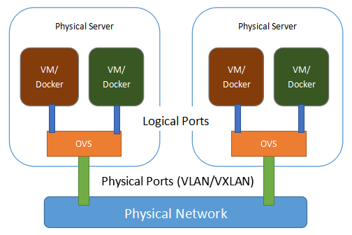
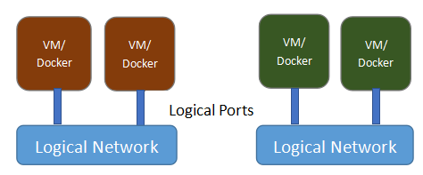
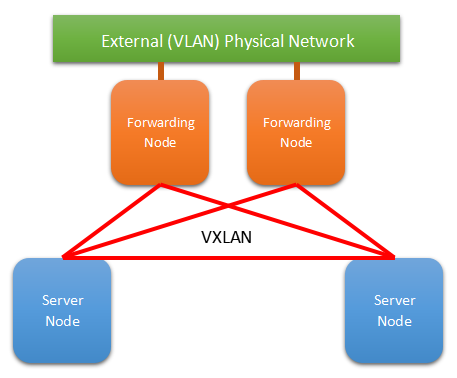
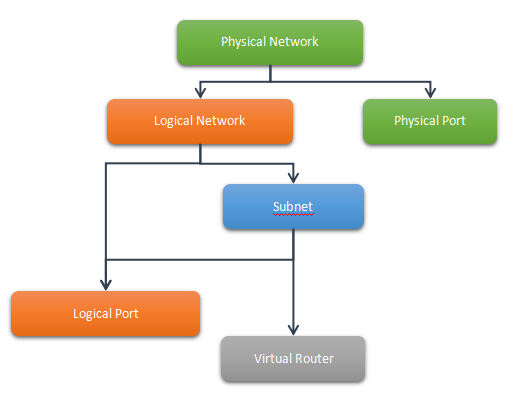

.. _quickunderstand:

Quick Understand on VLCP Network Concepts
=========================================
This tutorial is a quick describe on VLCP network concepts. You should read this
first to have better understanding on these concepts. They should be easy to
understand and look familiar for OpenStack users or users with experience on other
SDN products.

--------------------------
Layer-2 Network (Ethernet)
--------------------------

With the standard network model [#f1]_, VLCP assumes you connect your virtual machines or docker containers
with OpenvSwitch (or OVS) [#f2]_. 

The physical view of the network can be described with the following figure:

   
   *fig 1. Physical View of the Network*
   
In this figure, two physical servers are connected with an external network. On each server, two endpoints
(virtual machines or docker containers) are connected to an OVS bridge with a **Logical Port** for each
endpoint. A **Physical Port** which is connected to the external network (or the **Physical Network**) is
also connected to the OVS bridge, connecting endpoints on this physical server with endpoints on other
physical servers.

**Physical Network** refers to the external connections between physical servers. It must be a L2 connection,
means that it can transfer Ethernet packets from one physical server to another. Usually it can be separated
with VLAN-tag/VNI to isolate different type of traffic, making it possible to create multiple **Logical Networks**
on the same **Physical Network**. In most cases, the **Physical Network** should be:

   - A physical network connecting the physical server with "trunk" port in the physical switches,
     so different **Logical Networks** can be isolated with *VLAN* tag
   
   - A overlay network connecting the physical servers with VXLAN tunnels. Different **Logical Networks** can
     be isolated with *VXLAN* ID (or *VNI*)
   
If necessary, there could be more than one **Physical Networks** on the same physical server.

**Physical Port** refers the OVS port connecting the OVS bridge with the **Physical Network**.

   - For *VLAN* networks, the port should be a physical NIC or bonding of NICs which directly connects to
     physical switches, and configured to "trunk" on physical switches
     
   - For *VXLAN* networks, the port should be a tunnel port created in OVS. The method to create this type
     of ports will be introduced in other documents.
     
**Logical Port** refers the OVS ports connecting the endpoints to the OVS bridge. It is usually a virtual device
automatically created by external tools like *libvirt* or *vlcp-docker-plugin*. They act like access ports in
traditional network and switches.

Each **Logical Port** has a corresponding **Logical Network**. A **Logical Network** is a virtual L2 network
connecting endpoints from different physical servers with each other. Endpoints (or **Logical Ports**) in the same
**Logical Network** can send Ethernet packets to and receive Ethernet packets from each other, while they can not
send or receive Ethernet packets with endpoints in other **Logical Network**. You may consider a **Logical Network**
as a standard Ethernet for endpoints.

With the isolation function of the **Logcial Network**, endpoints can be grouped into virtual networks, no matter
what their physical locations are. Endpoints on different physical servers can access each other as if they are
connected to the same L2 switch. At the same time, endpoints on the same physical server can be isolated as if
they are connected to physical isolated networks. The logical view of the network looks like the following figure:

   
   *fig 2. Logical View of the Network*
   

--------------------------
Logical Network and Subnet
--------------------------

VLCP network is functional even in pure Ethernet mode, in which case only MAC addresses are necessary to be
configured on each **Logical Port**. But usually the network is used to transfer IP traffics, it is helpful
to set IP and subnet configurations on the **Logical Port**. L2 connectivity is always available with or without
subnet configurations.

IP configurations on a **Logical Network** is stored in a **Subnet**. Usually it contains CIDR and gateway of the
network, but more advanced configurations are also available like static routes and DHCP options. Currently
only IPv4 is supported.

A **Logical Port** is associated with both the **Logical Network** and the **Subnet**. The **Logical Network** association
creates the L2 connectivity while the **Subnet** association affects functions related to IP addresses. Functions
that need a **Subnet** configuration includes ARP proxy and embedded DHCP service.

--------------------------------
Layer-3 (IP) Network and Routing
--------------------------------

VLCP standard network model supports connecting different **Logical Networks** through L3 routing.

There are two types of networks in L3 routing: *internal networks* and *external networks*. *External networks*
are **Subnets** with external gateways, the gateway set in **Subnet** of an *external network* should be IP address
configured on external devices like physical routers. It should be accessible from the **Logical Network** VLAN or VXLAN.
"Internal networks* are **Subnets** with internal gateways, the gateway address should not be any existed IP address
in the network. VLCP SDN network will create a virtual router service for the networks as the default gateway of the
*internal networks*.

Virtual router service with both *internal networks* and *external networks* forwards traffic to outer networks
(Internet for example) through *external networks*. Correct routes for internal CIDRs should be configured in
external gateways with static routes or technologies like OSPF, or use NAT (not yet supported).

Sometimes *internal networks* and *external networks* are in different **Physical Networks**, and not all server nodes
have **Physical Ports** for **Physical Network** of the *external network**. For example, *internal networks* are
connected through VXLAN, while *external networks* are using VLAN for isolation. In this situation, some
*forwarding nodes* should be created to forward the traffic from *internal networks* to *external networks*.
They are almost the same as other server nodes except a few configurations are modified.

   
   *fig 3. L3 Network with Forwarding Nodes*
   
--------------------------
Network Settings Structure
--------------------------

To setup a new network, elements in the following figure should be created in order from top to bottom.

   
   *fig 3. Network Settings Structure*
   

.. rubric:: Footnotes

.. [#f1] We should mention that VLCP is a full stack SDN controller which is:
      
            1. An asynchronous network programming framework with dynamic module mangement functions
            2. An OpenFlow controller framework friendly for extending
            3. A product-ready controller for standard virtual network environment supported by default modules
         
         Loading different modules can give VLCP completely different functions. In this document, we assume
         users would like to use the standard network model (also named as "ViperFlow" model) to implement
         a quick SDN environment highly compatible with traditional networks. You may also want to develope
         your own SDN controller, possibly supporting OpenFlow 1.0, or targeting physical OpenFlow switches.
         In that situation, you do not need to be bounded to this model. Refer to :ref:`developementguide`
         for more informations on developing your own controller with VLCP framework, or learn more about the
         implementation details of the standard model.

.. [#f2] OpenvSwitch is a software implementation of OpenFlow switch with customized extensions.
         It should be familiar to experienced SDN users. Most virtual network environments and tools
         (libvirt, for example) support using OpenvSwitch to connect network endpoints to external networks.
         You may learn more about OpenvSwitch from the official web site (http://openvswitch.org/)
         